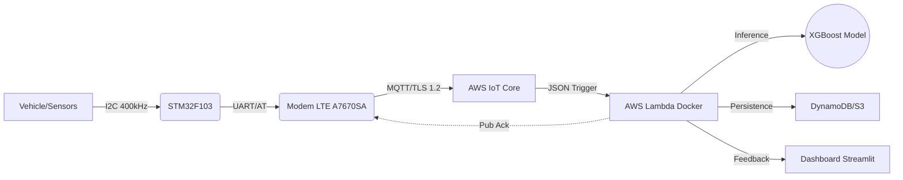

Here is the English version of the README.md, fully formatted and technical, ready to be copied into your project.

Markdown

# AIoT Vehicle Monitoring System (Driver Behavior Profiling)

## 📖 About the Project

A complete AIoT (*Artificial Intelligence of Things*) solution for real-time driver behavior profiling, focusing on road safety and operational efficiency. The system integrates custom embedded hardware, LTE connectivity via secure MQTT, and a Serverless backend on AWS that runs Machine Learning models to classify driving into three categories: **Safe/Slow**, **Normal**, or **Aggressive**.

This project was developed as a Final Year Project (TCC) in Electrical Engineering at the Federal University of Paraná (UFPR).

---

## 📑 Table of Contents
1. [Architecture Overview](#-architecture-overview)
2. [Hardware (PCB and Components)](#-hardware-pcb-and-components)
3. [Firmware (STM32)](#-firmware-stm32)
4. [Machine Learning and Data](#-machine-learning-and-data)
5. [Cloud Infrastructure (AWS)](#-cloud-infrastructure-aws)
6. [Results and Performance](#-results-and-performance)
7. [Repository Structure](#-repository-structure)
8. [How to Run](#-how-to-run)

---

## 🏗 Architecture Overview

The system operates in a closed loop: the hardware collects inertial data at 20Hz, performs edge filtering, and transmits it via the LTE cellular network to the cloud. AWS processes the data, executes AI inference, and returns feedback to the device and the dashboard in real-time.

## 🔌 Hardware (PCB and Components)

The hardware was designed for vehicular environments with electrical noise and vibration.

### Components
- **MCU:** STM32F103C8T6 (ARM Cortex-M3 @ 72 MHz)  
- **Connectivity:** SIMCom A7670SA (LTE Cat-1, native SSL/TLS)  
- **Sensors:** MPU-6050 (6-DOF accelerometer + gyroscope)  
- **Power:** Buck DC-DC 12V → 5V (3 A) + 3.3V LDOs  

### Interfaces
- **I2C @ 400 kHz**  
- **UART** using AT-commands for LTE modem  
- **USB** for firmware flashing  

### PCB Files
Located in the folder: **/hardware_pcb**

## 💻 Firmware (STM32)

Developed in C using the STM32 HAL API. The firmware uses a Finite State Machine (FSM) to manage asynchronous data acquisition and non-blocking transmission.

### Technical Highlights
- **DLPF Filter:** MPU-6050 configured with a 10 Hz cutoff (Register 0x05) to reduce engine vibration noise while preserving maneuver dynamics.  
- **Ring Buffers:** Circular buffers capturing both *pre-event* and *post-event* data (100 samples per window).  
- **Security:** TLS 1.2 with mutual authentication; X.509 certificates (Root CA, Device Certificate, Private Key) stored in the modem's NVRAM.  

## 🧠 Machine Learning and Data

The intelligence layer uses an XGBoost model optimized with Optuna, selected for its strong performance compared to traditional ensemble methods.

### Training Dataset
Composed of four heterogeneous public datasets to improve generalization:
- **UAH-DriveSet:** Highway reference  
- **Sensor Logger:** Urban driving reference  
- **ROCHI:** Sudden events and anomalies  
- **Driver Profile:** Brazilian driving behavior reference  

### Validation
- Field testing with **234 km** of real data collected in Curitiba  
- Additional validation using **Assetto Corsa** simulation telemetry  

### Feature Engineering
- **168 features** per window  
- Includes metrics in:
  - Time Domain  
  - Frequency Domain (FFT)  
  - Jerk  
  - Signal Energy  

### Classes
- **Safe (Safe/Slow)**  
- **Normal**  
- **Aggressive**  

### Balancing
- SMOTE (Synthetic Minority Over-sampling Technique) applied to correct class imbalance during model training  

## ☁️ Cloud Infrastructure (AWS)

A fully serverless architecture designed for scalability, resilience, and low total cost of ownership (TCO).

### Components

- **AWS IoT Core:**  
  Secure MQTT broker with routing rules for topics in the format `vehicles/+/events`.

- **AWS Lambda:**  
  Executes a Dockerized inference environment containing scikit-learn, pandas, and XGBoost.  
  Handles feature processing and model inference with low latency.

- **Zero Motion Gate:**  
  Cloud-side logic that skips heavy processing when the vehicle is stationary  
  (`σ < 0.2 m/s^2`), reducing compute time and Lambda cost.

- **Dashboard (Streamlit):**  
  Hosted on EC2, providing:
  - Real-time telemetry visualization  
  - Vector plots  
  - KPIs via WebSockets and MQTT  

## 📊 Results and Performance

Field validation demonstrated strong reliability and accuracy across all system layers.

### Metrics

| Metric           | Value  | Description                                                                 |
|------------------|--------|-----------------------------------------------------------------------------|
| **Global F1-Score** | 0.95   | High precision in driving risk classification (Holdout Test).              |
| **Avg. Latency**    | 5.25 s | End-to-end delay (Event → Cloud → Dashboard) over 4G with QoS 1.           |
| **Lambda Latency**  | 26 ms  | Model inference time after warm start.                                     |
| **Reliability**     | 100%   | MQTT session maintained by the A7670SA even in shadow zones (-113 dBm).    |

## 📜 License and Usage

This project is **not open-source**.

All files, code, models, and documentation in this repository are proprietary and may be used **only for personal or academic purposes**.

Commercial use, redistribution, or publication of this project (in whole or in part) is **strictly prohibited** without explicit permission from the author.

© 2025 Gustavo Puerari Araujo. All rights reserved.

## 👤 Author

**Gustavo Puerari Araujo**  
Electrical Engineer (UFPR)  
Emphasis in Electronics, Embedded Systems, and Telecommunications  
Email: *gupuerari@gmail.com* 